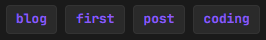

# How do I make blog posts in this template?
1. Create a **Markdown (.md)** file, with your post content and give it whatever name you want (for example, `my-first-post.md`). --> [Markdown Guide](https://www.markdownguide.org/)
2. Go to the file named `posts.json`.
3. In there, you will find an empty template that looks like this:

```json
{
    "posts": [
        {
            "title": "",
            "slug": "",
            "date": "",
            "excerpt": "",
            "tags": [""],
            "file": ""
        }
    ]
}
```
- In **"title"**, put whatever title you want to give your blog post. (for example, "My First Blog!").
- In **"slug"**, put the slug you want for your blog post. (for example, "first-post"). It will look like this:
**`[domain]/post.php?slug=your-slug`**
- In **"date"**, put the date of your blog post.
- In **"excerpt"**, put a description/short summary of your blog post. It will appear on the homepage as the description of the article.
- In **"tags"**, put relevant keywords or categories that describe your blog post. They will appear on the homepage, and they will look like this:



- And in **"file"** *(this is important!)*, put the link to your Markdown file, the one we created on **Step 1**.

### And there you go! Now you have a completely working blog post!